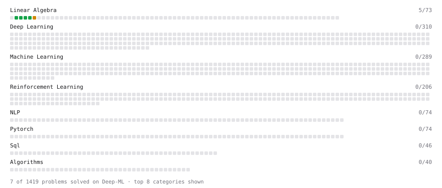

# Deep-ML

My machine learning practice from [Deep-ML](https://www.deep-ml.com). Every solution here was written by hand.

**5** solved · 5 problems · 0 labs · 0 math

[**Browse the interactive portfolio**](https://justAnotherDaydreamer.github.io/deep-ml/) to replay this filling in over time.

## Problems

| | Difficulty | Solved | |
| --- | --- | --- | --- |
| [Add a Per-Group Average Column with GroupBy Transform](https://www.deep-ml.com/problems/1136) | easy | 2026-09-19 | [solution](problems/1136-add-a-per-group-average-column-with-groupby-transform) |
| [Calculate Mean by Row or Column](https://www.deep-ml.com/problems/4) | easy | 2026-09-18 | [solution](problems/0004-calculate-mean-by-row-or-column) |
| [Handle Missing Data in pandas (dropna/fillna)](https://www.deep-ml.com/problems/1128) | easy | 2026-09-19 | [solution](problems/1128-handle-missing-data-in-pandas-dropna-fillna) |
| [Reshape Matrix](https://www.deep-ml.com/problems/3) | easy | 2026-09-18 | [solution](problems/0003-reshape-matrix) |
| [Transpose of a Matrix](https://www.deep-ml.com/problems/2) | easy | 2026-09-18 | [solution](problems/0002-transpose-of-a-matrix) |

---

_This file is regenerated by Deep-ML on every push._
